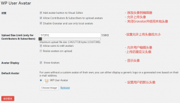

wordpress的头像采用Gravatar网站链接的头像。作为用户，需要 在Gravatar网站注册一个用户，在那个网站上传自己的头像，然后在wordpress里通过电子邮件的方式调用头像。但是现在Gravatar服务器被全面和谐，导致wordpress头像不显示，同时也导致wordpress网站的速度被拖慢。

解决办法:

安装WP User Avatar插件，可以在wordpress后台的 插件/安装插件 页面搜索安装，安装完成后可以在左侧菜单中找到选项，点击界面及设置内容如下：
<!--more-->

设置完成后在界面右上角选择 编辑我的个人资料 中设置自己的头像即可。