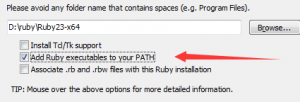
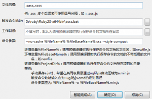

### 什么是css预处理器？

css预处理器定义了一种新的语言将css作为目标生成文件，然后开发者就只要使用这种语言进行编码工作了。预处理器通常可以实现浏览器兼容，变量，结构体等功能，代码更加简洁易于维护。
目前比较流行的两种是sass和less，其他的还有stylus、turbine、swithch css、css cacheer、dt css等。

通俗的说，“css 预处理器用一种专门的编程语言，进行 Web 页面样式设计，然后再编译成正常的 css 文件，以供项目使用。css 预处理器为 css 增加一些编程的特性，无需考虑浏览器的兼容性问题”，例如你可以在 css 中使用变量、简单的逻辑程序、函数等等在编程语言中的一些基本特性，可以让你的 css 更加简洁、适应性更强、可读性更佳，更易于代码的维护等诸多好处。
<!--more-->
### sass用法指南

sass是一种css的开发工具，提供了许多便利的写法，大大节省了设计者的时间，使得css的开发，变得简单和可维护。

ruby的安装：

sass依赖于ruby环境，因此在安装sass之前需要安装ruby。需在官网下载ruby。

在安装的时候，请勾选Add Ruby executables to your PATH这个选项，添加环境变量，不然以后使用编译软件的时候会提示找不到ruby环境。



sass的安装：

安装完ruby之后，在开始菜单中找到安装好的的ruby，打开Start Command Prompt with Ruby，

接着在命令行输入下面的命令：
```
gem install sass
```
等待安装完成。

完成后输入下面的命令查看sass的版本号：
```
sass -v
```
编辑器hbuilder中sass的设置：

选择 工具/预编译器设置/.sass，.scss 右侧选择编辑选项，触发命令地址为ruby安装路径下bin文件夹中的sass.bat文件，命令参数如下：
```
--no-cache %FileName% %FileBaseName%.css --style compressed
```



环境变量%FileName%：调用预编译器时执行保存命令的文档的文件名，如style.scss。

环境变量%FileBaseName%：调用预编译器时执行保存命令的文档的不带后缀的文件名，如style。

–style compact：编译风格，sass提供四种编译风格，如下：

nested：嵌套缩进的css代码，它是默认值。

expanded：没有缩进的、扩展的css代码。

compact：简洁格式的css代码。

compressed：压缩后的css代码。

项目中一般选择编译为压缩后的css代码。

上面命令参数的意思为：在sass文件所在的目录生成一个名为style的经过压缩的css文件。

至此，hbuilder下sass的安装就完成了。

需要了解sass用法的朋友点击

 