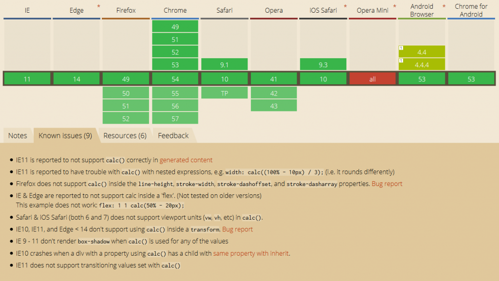

### calc()是什么？

calc是英文单词calculate(计算)的缩写，是css3的一个新增的功能，用来指定元素的长度。它可以让你使用一个算术表达式来表达长度值，这意味着可以用它来定义div的宽度，并设置margin、padding、border等。

### calc()能做什么？
<!--more-->
calc()可以用来给元素做计算，例如“width:calc(50% + 20px)”，这样一来你就不用考虑元素的宽度值到底是多少，而是通过计算机来计算。

### calc()的运算规则

+ 使用”+”、”-”、”*”、”/”四则运算
+ 可以使用百分比、px、em、rem等单位
+ 可以混合使用各种单位进行计算。
+ 表达式中有“+”和“-”时，其前后必须要有空格，如”widht: calc(50%+20px)”这种没有空格的写法是错误的
+ 表达式中有“*”和“/”时，其前后可以没有空格

### 浏览器兼容性

pc端主流浏览器支持性较好（ie8及以下不支持），移动端UC浏览器暂不支持。