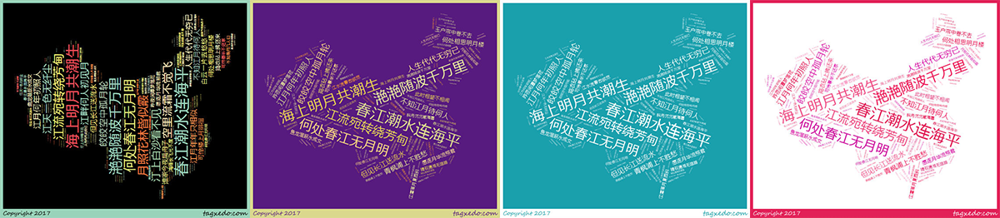
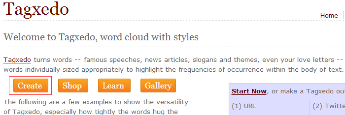
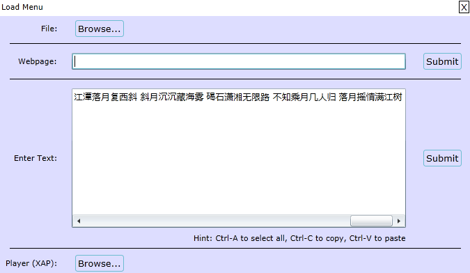
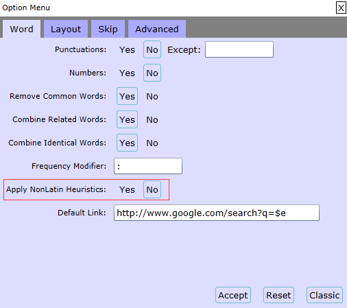
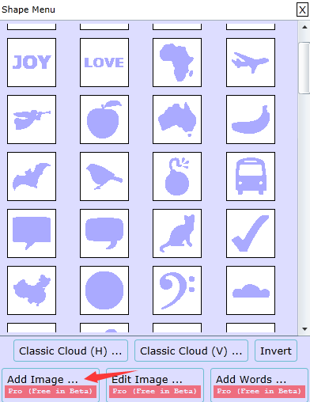
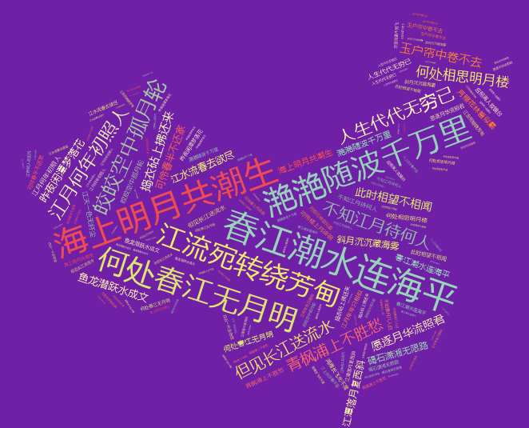
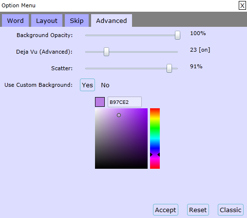
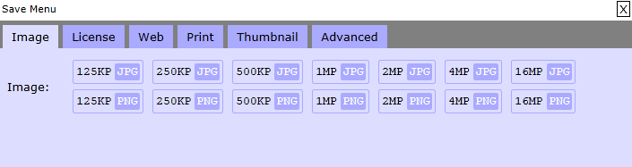

<!--more-->

“词云”就是对网络文本中出现频率较高的“关键词”予以视觉上的突出，形成“关键词云层”或“关键词渲染”，从而过滤掉大量的文本信息，使浏览网页者只要一眼扫过文本就可以领略文本的主旨。常用的制作工具有Tagxedo、图悦、ImageChef等，这里简单介绍下使用Tagxedo制作词云的过程。

TagxeDo是一个功能强大的在线云词成像制作工具,支持中文而且可以做很多的设置以达到你想要的效果，可以把人物头像用单词或者文字来制作成词图样式，可以定制云的外形、可以提取导入的文本或Url内容的关高频词作为构成元素，通过自定义配色，绘制属于你的完美标签云。

进入网站：[TagxeDo](http://www.tagxedo.com/)

使用TagxeDo工具需要安装一个插件，需要先安装Silverlight插件，这个插件是一个跨浏览器、跨客户平台的技术，能够设计、开发和发布有多媒体体验与富交互(RIA,Rich Interface Application)的网络交互程序。)

### 开始制作

点击`Create`开始制作：

点击`Load`输入文字，submit提交

### 避免文字拆分
完成后发现文字被拆分成多块，在左边菜单栏选择Word | Layout Options，进入后顶部选择Word找到Apply NonLatin Heuristics的选项，将原来默认的Yes改为No就可以得到我们要的效果。

### 更换背景形状

左侧选择`Options/Shape`后可以看到很多的形状，选择喜欢的形状变更。

如需使用自定义形状点击下方`Add Image`上传图案。

### 文字方向

点击左侧`orientation`更换文字排列方向

### 调整颜色、主题以及背景颜色

侧菜单栏`Respins/Color`点击逆时针就会看到文字云自动调整颜色分布。

点击左侧`Theme`右边的逆时针或者三角符号选择自己喜欢的主题颜色。

在左边菜单栏选择`Word | Layout Options`，进入后顶部选择`Advantage`更换背景颜色。

### 保存与分享

点击左侧`Save`选择合适的图片大小保存。

