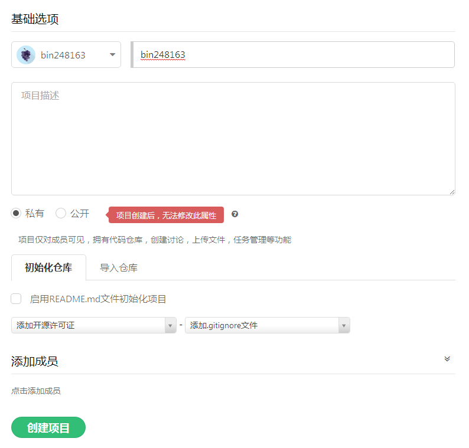
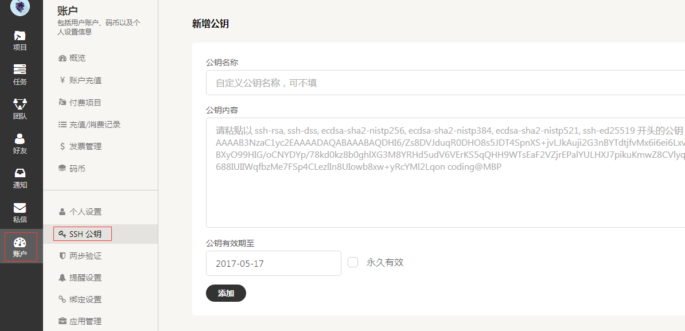
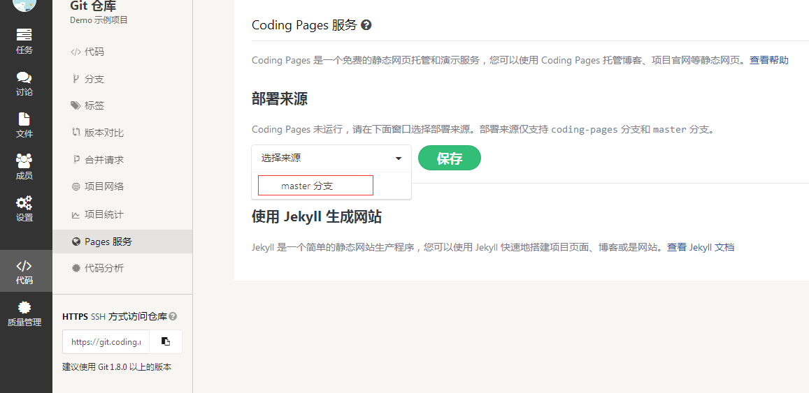

之前我们把hexo托管在github，但是毕竟github是国外的，访问速度得不到保证，还有一点因为百度联盟广告脚本被插入攻击github导致github禁止百度爬虫，所以百度的收录也有问题，因此在国内的托管平台部署一份也很重要，权衡之下决定部署到coding。
### coding注册 创建项目
在coding上注册账号并创建项目,项目名称需要与账户名称一致,否则可能因为路径错误使一些资源如样式等加载失败。<!--more-->


### 配置修改
需要把blog同时部署到github与coding需要在根目录_config.yml中做出如下修改：
```
deploy: 
  type: git
  repo: 
    github: http://github.com/bin248163/bin248163.github.io.git
    coding: http://git.coding.net/bin248163/bin248163.git
branch: master
```

注意代码中的空格
### 公钥设置
与github公钥添加过程相同，在本地找到.ssh文件，复制文件内容到如下位置：



在git bash中执行：
```
ssh -T git@git.coding.net
```
结果如下则表示添加成功：
```
Hello bin248163! You've connected to Coding.net via SSH successfully!
```
### 创建Github Pages和Coding Pages 服务
GitHub Pages分两种，一种是你的GitHub用户名建立的username.github.io这样的用户&组织页（站），另一种是依附项目的pages。想建立个人博客是用的第一种，形如bin248163.github.io这样的可访问的站，每个用户名下面只能建立一个。

在项目中选择左侧代码再点击Coding Pages 服务开启。分支和github分支写一样，填写master



### blog上传

```
hexo d -g
```
### 添加自定义域名
域名管理面板中添加 CNAME记录解析到pages.coding.me，然后，在「Pages 服务」设置页中的自定义域名栏目输入绑定的域名，点击「保存」即可通过自定义域名访问您的网站。


