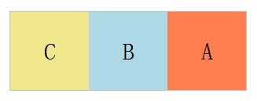
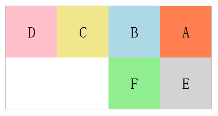
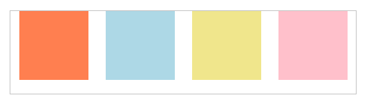
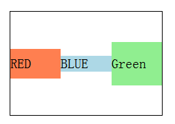
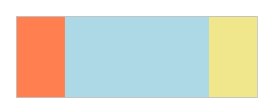
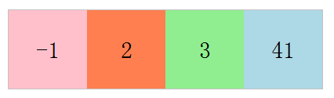
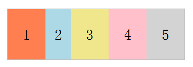
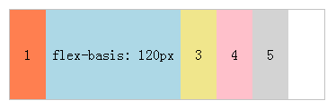
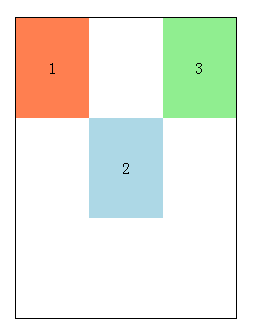

### 采用Flex布局的元素，称为Flex容器（flex Container）。它的所有子元素自动成为容器成员，称为Flex项目（flex item）。
指定一个块级元素为Flex布局：
```
.box{
  display: -webkit-flex; /* Safari */
  display: flex;
}
```
<!--more-->
+ 注意: Internet Explorer 9 及更早版本不支持 flex 属性。
+ 注意: Internet Explorer 10 通过 -ms-flex 属性来支持。 IE11 及更新版本完全支持 flex 属性 (不需要 -ms- 前缀)。
+ 注意: Safari 6.1 (及更新浏览器) 通过 -webkit-flex 属性支持。

指定一个行内元素为Flex布局：
```
.box{
  display: inline-flex;
}
```
容器默认存在两根轴：水平的主轴`main axis`和垂直的交叉轴`cross axis`。主轴的开始位置（与边框的交叉点）叫做`main start`，结束位置叫做`main end`；交叉轴的开始位置叫做`cross start`，结束位置叫做`cross end`。
项目默认沿主轴排列。单个项目占据的主轴空间叫做`main size`，占据的交叉轴空间叫做`cross size`。


### 容器的属性
+ flex-direction
+ flex-wrap
+ flex-flow
+ justify-content
+ align-items
+ align-content

##### flex-direction属性决定主轴的方向
```
.box {
  flex-direction: row | row-reverse | column | column-reverse;
}
```
+ row（默认值）：主轴为水平方向，起点在左端。
+ row-reverse：主轴为水平方向，起点在右端。
+ column：主轴为垂直方向，起点在上沿。
+ column-reverse：主轴为垂直方向，起点在下沿。

主轴为水平方向，起点在右端:


##### flex-wrap属性定义项目如何换行如何换行。
```
.box{
  flex-wrap: nowrap | wrap | wrap-reverse;
}
```
+ nowrap（默认）：不换行。
+ wrap：换行，第一行在上方。
+ wrap-reverse：换行，第一行在下方。

##### flex-flow 属性是 flex-direction 和 flex-wrap 属性的复合属性,用于设置或检索弹性盒模型对象的子元素排列方式,默认值为`row nowrap`。

```
.box {
  flex-flow: <flex-direction> <flex-wrap>;
}
```
.main内的元素主轴为水平方向，起点在右端，并换行：

##### justify-content属性定义了项目在主轴上的对齐方式。
```
.box {
  justify-content: flex-start | flex-end | center | space-between | space-around;
}
```
+ flex-start（默认值）：左对齐
+ flex-end：右对齐
+ center： 居中
+ space-between：两端对齐，项目之间的间隔都相等。
+ space-around：每个项目两侧的间隔相等。所以，项目之间的间隔比项目与边框的间隔大一倍。

项目位于各行之前、之间、之后都留有空白的容器内。


##### align-items属性定义项目在交叉轴上如何对齐。
```
.box {
  align-items: flex-start | flex-end | center | baseline | stretch;
}
```
+ flex-start：交叉轴的起点对齐。
+ flex-end：交叉轴的终点对齐。
+ center：交叉轴的中点对齐。
+ baseline: 项目的第一行文字的基线对齐。
+ stretch（默认值）：如果项目未设置高度或设为auto，将占满整个容器的高度。

项目位于容器的中心。


##### align-content属性定义了多根轴线的对齐方式。如果项目只有一根轴线，该属性不起作用。
```
.box {
  align-content: flex-start | flex-end | center | space-between | space-around | stretch;
}
```
+ flex-start：与交叉轴的起点对齐。
+ flex-end：与交叉轴的终点对齐。
+ center：与交叉轴的中点对齐。
+ space-between：与交叉轴两端对齐，轴线之间的间隔平均分布。
+ space-around：每根轴线两侧的间隔都相等。所以，轴线之间的间隔比轴线与边框的间隔大一倍。
+ stretch（默认值）：轴线占满整个交叉轴。

##### flex-grow属性定义项目的放大比例，默认为0，即如果存在剩余空间，也不放大。
```
.item {
  flex-grow: <number>; /* default 0 */
}
```
让第二个元素的宽度为其他元素的三倍：

如果元素不是弹性盒对象的元素，则 flex-grow 属性不起作用。

##### order属性定义项目的排列顺序。数值越小，排列越靠前，默认为0。
```
.item {
  order: <integer>;
}
```

##### flex-shrink属性定义了项目的缩小比例，默认为1，即如果空间不足，该项目将缩小。
```
.item {
  flex-shrink: <number>; /* default 1 */
}
```
如果所有项目的flex-shrink属性都为1，当空间不足时，都将等比例缩小。如果一个项目的flex-shrink属性为0，其他项目都为1，则空间不足时，前者不缩小。如果一个项目的flex-shrink属性为2，其他项目都为1，则空间不足时，前者为其他元素的一半.

##### flex-basis属性定义了在分配多余空间之前，项目占据的主轴空间（main size）。浏览器根据这个属性，计算主轴是否有多余空间。它的默认值为auto，即项目的本来大小。
```
.item {
  flex-basis: <length> | auto; /* default auto */
}
```
它可以设为跟width或height属性一样的值（比如350px），则项目将占据固定空间。

##### flex属性是flex-grow, flex-shrink 和 flex-basis的简写，默认值为0 1 auto。后两个属性可选。
```
.item {
  flex: none | [ <'flex-grow'> <'flex-shrink'>? || <'flex-basis'> ]
}
```
建议优先使用这个属性，而不是单独写三个分离的属性，因为浏览器会推算相关值。
   
##### align-self属性允许单个项目有与其他项目不一样的对齐方式。
可覆盖align-items属性。默认值为auto，表示继承父元素的align-items属性，如果没有父元素，则等同于stretch。
```
.item {
  align-self: auto | flex-start | flex-end | center | baseline | stretch;
}
```


