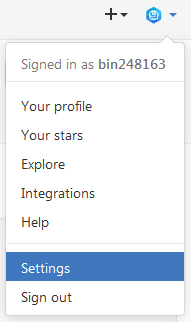
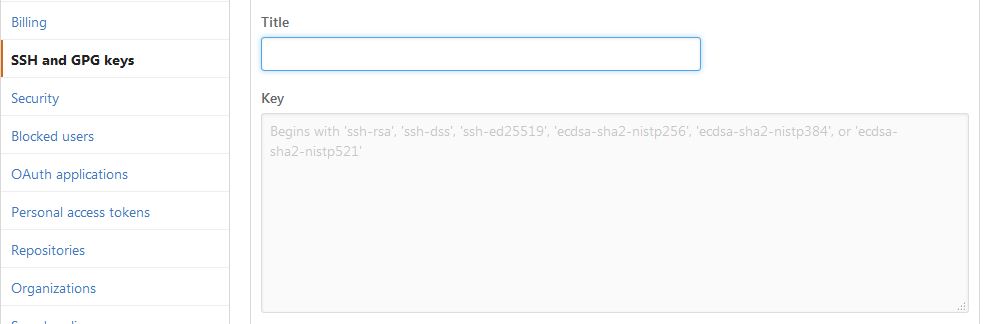
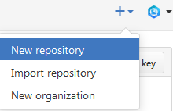
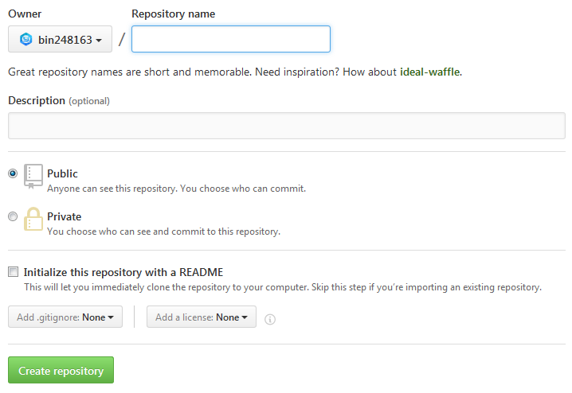
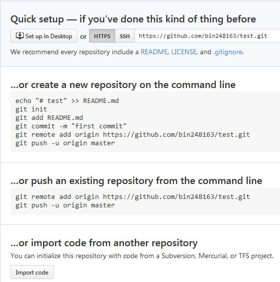
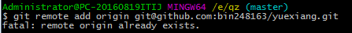

### 安装Git

msysgit是Windows版的Git，下载地址。

安装完毕运行“Git”->“Git Bash”，在命令行输入

```
$ git config --global user.name  "Your Name"
$ git config --global user.email "email@example.com"
```
完成安装。
<!--more-->
### 创建版本库

```
$ mkdir git
$ cd E:\git
$ pwd
/e/git
```
### 创建Git管理仓库
```
$ git init
Initialized empty Git repository in E:/git/.git/
```
目录默认隐藏，通过ls -ah命令可以看见。

### 把文件添加到仓库
```
$ git add index.asp
```
添加目录下所有文件到仓库
```
$ git add .
```
忽略特殊文件：

在Git工作区的根目录下创建一个.gitignore文件，然后把要忽略的文件名填进去，Git就会自动忽略这些文件。

### 文件提交到仓库
```
$ git commit -m "提交说明"
[master (root-commit) 96f2439] index.asp
 1 file changed, 198 insertions(+)
 create mode 100644 index.asp
```
commit可以一次提交很多文件，所以可以多次add不同的文件。
```
$ git add file1.txt
$ git add file2.txt file3.txt
$ git commit -m "提交说明"
```
git status命令可以查看仓库当前的状态。
```
$ git status
On branch master
nothing to commit, working tree clean
```
Git告诉我们当前没有需要提交的修改，而且，工作目录是干净的。

### 版本回退

使用git log命令查看历史记录
```
$ git log
commit 17a86ced31dd11a804f895245f4ea76e4208e399
Author: yzb <1047576335@qq.com>
Date:   Tue Sep 13 10:18:03 2016 +0800
 
    添加所有文件
 
commit 7e9d7598546a6ac4b6ac41fbdf4c7933005cb7d2
Author: yzb <1047576335@qq.com>
Date:   Tue Sep 13 09:28:47 2016 +0800
 
    添加所有文件
 
commit 96f2439b5844d2c9cb7636a46a4720477dd84bfa
Author: yzb <1047576335@qq.com>
Date:   Tue Sep 13 09:24:32 2016 +0800
 
    index.asp
```
回退到上一个版本“add distributed”，使用git reset命令
```
$ git reset --hard HEAD^
HEAD is now at 7e9d759 添加所有文件
```
通过版本号回退到任意版本
```
$ git reset --hard 96f24
HEAD is now at 96f2439 index.asp
```
git reflog用来记录每次操作
```
$ git reflog
96f2439 HEAD@{0}: reset: moving to 96f24
7e9d759 HEAD@{1}: reset: moving to HEAD^
17a86ce HEAD@{2}: commit: 添加所有文件
7e9d759 HEAD@{3}: commit: 添加所有文件
96f2439 HEAD@{4}: commit (initial): index.asp
```
丢弃工作区的修改时，用命令git checkout -- file

丢弃暂存区修改时，分两步，第一步用命令git reset HEAD file回到工作区，再执行上面的命令。

### 删除文件

删除文件使用直接删除或者rm命令。
```
$ rm index.asp
```
删除文件夹及其下的所有文件
```
$ git rm ss-tab -r -f
```
使用git status命令查看哪些文件被删除

确认删除该文件，使用命令git rm删掉，并git commit
```
$ git rm index.asp
rm 'index.asp' 
$ git commit -m "remove index.asp"
[master ff03b82] remove index.asp
 1 file changed, 198 deletions(-)
 delete mode 100644 index.asp
```
恢复删除使用git checkout
```
$ git checkout -- index.as
```
### 创建SSH Key

注册GitHub账号，在git bath中输入如下命令：
```
$ ssh-keygen -t rsa -C "1047576335@qq.com
```
在/c/Users/Administrator/.ssh/路径下找到id_rsa和id_rsa.pub两个文件，登录Github，点击右上角Settings。



选择SSH and GPG keys，填上任意Title，在Key文本框里粘贴id_rsa.pub文件的内容。



### 添加远程库

右上角点击“New repository”按钮，创建一个新的仓库：





在Repository name填入项目名称，其他保持默认设置，点击“Create repository”按钮，就成功地创建了一个新的Git仓库



### 把本地仓库的内容推送到GitHub仓库

本地仓库下运行命令：
```
$ git remote add origin git@github.com:bin248163/test.git
```
输入上述命令报错：



输入如下命令即可：
```
$ git remote rm origin
```
把本地库的所有内容推送到远程库上：
```
$ git push -u origin master
```
把本地的最新修改推送至GitHub：
```
$ git push origin master
```
### 从GitHub克隆库到本地

本地运行git clone命令：
```
$ git clone git@github.com:bin248163/Rolling-load.git
Cloning into 'Rolling-load'...
remote: Counting objects: 25, done.
remote: Compressing objects: 100% (24/24), done.
remote: Total 25 (delta 0), reused 25 (delta 0), pack-reused 0
Receiving objects: 100% (25/25), 2.59 MiB | 55.00 KiB/s, done.
```