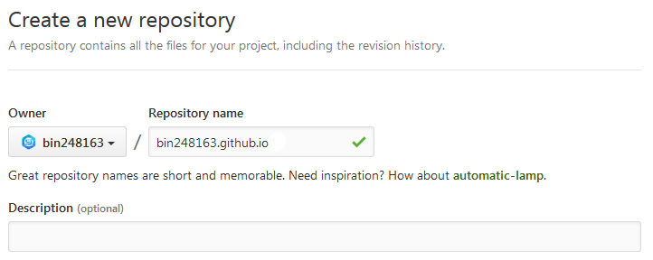
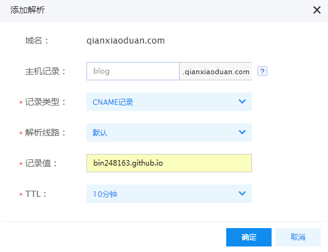

工作以后学的东西多了，接触的东西多了，才发现做笔记是一件很重要的事情，做笔记可以将自己的想法、思路写下来，方便以后查阅，做笔记、写博客可以让自己学会总结、学会分享，开始使用wordpress来搭建博客，乐此不疲的搞了段时间之后发现太麻烦了，后来开始使用github，接触到使用来搭建博客的方法，而且使用github作为服务器这样还省去了租用服务器的费用，下面是详细的制作过程：

### GitHub Pages是什么？

GitHub Pages本用于介绍托管在GitHub的项目， 不过，由于他的空间免费稳定，用来做搭建一个博客再好不过了。
github Pages可以被认为是用户编写的、托管在github上的静态网页。
<!--more-->
### 安装软件

[Node.js](https://nodejs.org/en/)
[Git(windows版本)](https://git-for-windows.github.io/)

### 安装和配置Hexo

打开GitBash，全局安装Hexo

``` bash
$ npm install -g hexo
```

新建一个文件夹来放置博客所需要的所有文件(假设文件路径为E:/blog)，

``` bash
$ cd E:/blog
$ hexo init
```

Hexo随后会自动在目标文件夹建立网站所需要的所有文件,然后在当前路径下执行如下步骤：

生成静态页面（g为generate缩写）

``` bash
$ hexo g
```
启动本地预览（s为server缩写）
``` bash
$ hexo s
```

浏览器输入localhost:4000如果配置正确即可看到效果

### 博客主题的选择

[知乎：有哪些好看的 Hexo 主题？](https://www.zhihu.com/question/24422335)

选择需要的主题下载至博客根目录themes文件夹下

### 启用主题

修改博客跟目录下的config.yml配置文件中的theme属性，将其设置为主题文件夹名称

更新主题：
``` bash
$ cd themes/主题文件夹名称
```
查看预览
``` bash
$ hexo g
$ hexo s
```

### 配置Github

新建一个仓库，仓库名要和你的Github账号对应



打开根目录下_config.yml文件，更改最底部的deploy配置
``` bash
deploy: 
  type: git
  repo: http://github.com/bin248163/bin248163.github.io.git
branch: master
```
repo行需要替换成你自己的仓库路径，保存之后运行如下命令：
``` bash
$ npm install hexo-deployer-git --save
$ hexo deploy(可以缩写成d)
```
至此Hexo已与github关联好，在浏览器输入username.github.io/就可以浏览了
### 设置独立域名
域名管理面板中添加 CNAME记录解析到username.github.io



在source文件夹下新建一个名为CNAME的无后缀文件，写入需要绑定的独立域名`hexo d -g`即可
