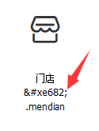

Iconfont.cn是由阿里巴巴UX部门推出的矢量图标管理网站，也是国内首家推广Webfont形式图标的平台。网站涵盖了1000多个常用图标并还在持续更新中，Iconfont平台为用户提供在线图标搜索、图标分捡下载、在线储存、矢量格式转换、个人图标库管理及项目图标管理等基础功能。同时iconfont.cn平台作为矢量图标倡导者，积极在线分享矢量图标制作经验、前端应用说明，及应用中常见的一些问题。[网站地址](http://www.iconfont.cn/)

Iconfont的优势：

+ 可自由变化大小
+ 可自由修改颜色（仅限于纯色）
+ 可以添加一些视觉效果如：阴影、旋转、透明度
+ 前端开发中可以从平台上下载到：ttf、woff、eot、svg等矢量格式的图标文件，应用到页面开发中去。

<!--more-->

通过导航顶部搜索框搜索图标或从某个库中选择图标存入暂存库：


完成图标选择后，从暂存架中选择图标的获取模式：” 存储为项目” OR ” 下载至本地”

用户点击”下载至本地”，系统会将包含“ttf、woff、eot、svg”等文件的压缩包下载至用户电脑本地。

“存储为项目”是指将用户选择的图标存储到淘宝CDN上，可以在iconfont.cn个人图标管理>项目图标管理中创建一个新项目或者存入历史记录，方便用户下次对项目图标的增加或删除；

在iconfont.css文件中获取前端应用代码：
```css
@font-face {font-family: "iconfont";
  src: url('iconfont.eot?t=1474874755'); /* IE9*/
  src: url('iconfont.eot?t=1474874755#iefix') format('embedded-opentype'), /* IE6-IE8 */
  url('iconfont.woff?t=1474874755') format('woff'), /* chrome, firefox */
  url('iconfont.ttf?t=1474874755') format('truetype'), /* chrome, firefox, opera, Safari, Android, iOS 4.2+*/
  url('iconfont.svg?t=1474874755#iconfont') format('svg'); /* iOS 4.1- */
}
 
.iconfont {
  font-family:"iconfont" !important;
  font-size:16px;
  font-style:normal;
  -webkit-font-smoothing: antialiased;
  -webkit-text-stroke-width: 0.2px;
  -moz-osx-font-smoothing: grayscale;
}
.icon-mendian:before { content: "\e682"; }
```
代码中字体文件默认与页面同目录，需重新指定字体文件路径。

获得图标对应的字体编码：



将图标字体应用于页面：
```html
<i class="iconfont">&#xe682;</i>
```
使用i标签需添加display：block或display：inline-block属性。

##### 关于火狐等浏览器.woff格式字体文件404报错报错的解决办法

在iis下添加woff的mime类型即可，其值为application/x-font-woff