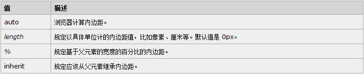
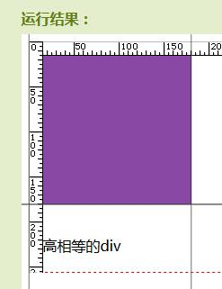
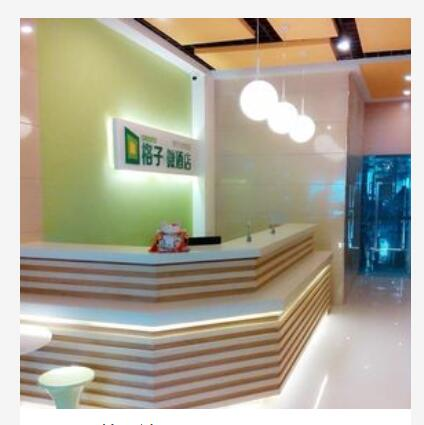

在使用css的padding/margin属性时，有一个值可能是我们没有注意到的


<!--more-->
就是当padding/margin值的单位为百分比的值时，它的top/right/bottom/left都是基于父元素的宽度的，这可能与我们想的不太一样~

利用这点我们可以做一些有趣的东西：

比如说做一个长宽相等图片列表，在pc端我们只需要给图片固定的宽度高度就可以轻松实现，但在移动端使用px和百分比布局就不能这样做了（rem布局可以很轻松的实现[入口]），移动端图片列表因为考虑到不同设备兼容的问题，所有大都选择宽度为百分比的布局方式，但这样的话图片的高度就没法设置，如果使用图片自身高度撑起容器高度的办法，在页面加载时图片没有加载出来的那段时间图片是不能撑起容器高度的。

解决办法：

当元素padding/margin值的单位为百分比的值时，它的top/right/bottom/left都是基于父元素的宽度的，而元素的百分比宽度也是基于父元素宽度的，这样就有思路了：
```
div {
  padding-top:20%;
  width:20%;
  background:#f00;
}
```
运行结果如下：



虽然div的高度为0，但因为有padding-top的原因在我们看来这还是一个宽高相等的div。

接下来我们要做的就是往元素中添加图片， 该元素的高度为0，我们不能直接在里面插入图片，需要用到定位的方式：
```
div {
  padding-top:20%;
  width:20%;
  background:#f00;
  position:relative;
  overflow:hidden;
}
img{
  width:100%;
  top:0;
  left:0;
  position:absolute;
}
```
效果如下：



宽高不一致的图片列表同理