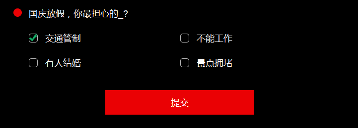

方法的实现原理为把input按钮的透明度设置为0，然后在外层用div包裹，通过使用js对外层div添加样式来模拟按钮选中状态。

html代码：
```
 <div class="check-w"><input type="radio" name="check" class="check"/></div>
```
<!--more-->
css代码：
```
.check-w {width: 24px;height: 18px;cursor: pointer;text-align: center;background-image: url(../images/check1.png);background-repeat: no-repeat;background-position: 0 -1px;}
.check {opacity: 0;display:block;cursor: pointer;filter: alpha(opacity=0);}
.this {background-position: 0 -22px;}
```
在radio中，选框为单选框，即在多个选项中只能选择一个，因此只需要在为一个radio外层添加样式的同时移除其它radio外层div样式即可。

js代码如下：
```
$(".check-w").click(function(){
  $(this).addClass("this").siblings().removeClass("this");
})
```



在checkbox中，选框为多选，即可以同时选择多个选项，因此只需要为同一个checkbox第一次次点击的时候添加样式，第二次点击时移除样式即可。

js代码如下：

JQ1.9以上版本移除了toggle事件因此可以使用如下方式
```
var flag=1;
    $(".check-w").click(function(){
        if(flag==1){
            $(this).addClass("this");
            flag=0;
        }else{
            $(this).removeClass("this");
            flag=1;
        }
```
也可以使用JQ1.9以下版本
```
$(".check-w").click(function(){
  $(this).toggleClass( "this" );
})
```

背景图片：

