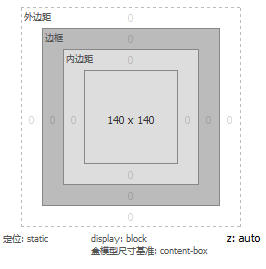
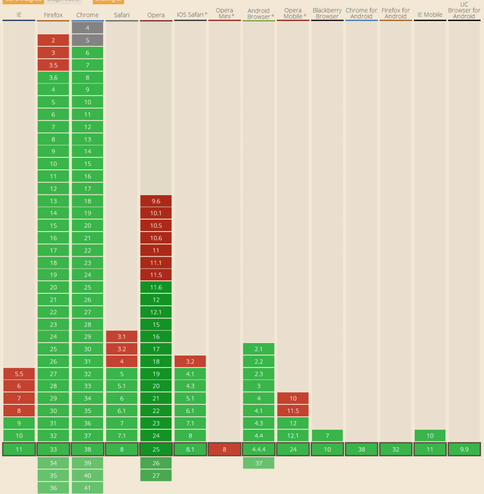

如今市面上移动设备的分辨率各种各样，网页设计中常用的单位px在移动端布局中显得力不从心，css3的出现了一个带来了一个新的css单位——rem，rem是解决移动端分辨率适配问题比较完美的方案。
### 什么是rem？

rem（font size of the root element）是指相对于根元素的字体大小的单位。简单的说它就是一个相对单位。看到rem大家 一定会想起em单位，em（font size of the element）是指相对于父元素的字体大小的单位。它们之间其实很相似，只不过一个计算 的规则是依赖根元素一个是依赖父元素计算。

rem于em其实有点类似，不同的是rem是相对于根元素的字体大小的单位，em指相对于父元素的字体大小的单位。
<!--more-->
### rem的使用
rem相对于根元素<html>的font-size来做计算,举个例子：
设置根元素<html>的font-size：14px，div宽高为10rem，则得到一个宽高各为140px的div。
```css
 html{font-size: 14px;}
 div{width: 10rem;height: 10rem;background: #ff6700;}
```

使用rem布局需要在不同的分辩率下给根元素<html>的font-size不同的值，具体的实现方式有以下两种：

1.使用媒介查询
```css
@media only screen and (max-width: 320px){html{font-size: 9px;} }
@media only screen and (min-width: 320px) and (max-width: 352px){html{font-size: 10px;} }
@media only screen and (min-width: 352px) and (max-width: 384px){html{font-size: 11px;} }
@media only screen and (min-width: 384px) and (max-width: 416px){html{font-size: 12px;} }
@media only screen and (min-width: 416px) and (max-width: 448px){html{font-size: 13px;} }
@media only screen and (min-width: 448px) and (max-width: 480px){html{font-size: 14px;} }
@media only screen and (min-width: 480px) and (max-width: 512px){html{font-size: 15px;} }
@media only screen and (min-width: 512px) and (max-width: 544px){html{font-size: 16px;} }
@media only screen and (min-width: 544px) and (max-width: 576px){html{font-size: 17px;} }
@media only screen and (min-width: 576px) and (max-width: 608px){html{font-size: 18px;} }
@media only screen and (min-width: 608px) and (max-width: 640px){html{font-size: 19px;} }
@media only screen and (min-width: 640px){html{font-size: 20px;} }
```
2.通过js计算
```javascript
 !(function(doc, win) {
 var docEle = doc.documentElement,
 event = "onorientationchange" in window ? "orientationchange" : "resize",
 fn = function() {
 var width = docEle.clientWidth;
 width<640?docEle.style.fontSize = 10 * (width / 320) + "px":docEle.style.fontSize = 16 + "px";
 };
 
 win.addEventListener(event, fn, false);
 doc.addEventListener("DOMContentLoaded", fn, false);
}(document, window));
```
需注意的是使用rem布局需在页面头部定义mate标签禁止页面缩放：
```html
 <meta name="viewport" content="width=device-width, initial-scale=1.0,maximum-scale=1.0,user-scalable=0"/>
```
Viewport语法

width:控制viewport的大小，一般情况下指定为device-width(单位为缩放为100%的CSS像素),也可以指定一个固定的值。

height:和width相应,指定高度。

initial-scal:初始缩放比例,页面第一次load的时候的缩放比例。

maximum-scale:允许用户缩放到的最大比例。

minimum-scale:允许用户缩放到的最小比例。

user-scalable:用户是否可以手动缩放。

### rem使用中遇到的问题

1.同时使用了js判断与媒介查询判断在页面载入时可能出现页面重新布局，原因是媒介查询根据一定的像素范围给定字体的大小值，例如：
```css
@media only screen and (min-width: 608px) and (max-width: 640px){html{font-size: 19px;} }
```
而js在不同像素下计算字体的大小是不一样的可能会出现带小数位的字体大小，同时使用就会出现页面载入时页面重新布局的现象，建议js判断与媒介查询选择一种使用。

2.rem布局做出来的页面效果与效果图有些许偏差

不同浏览器计算rem转换为px数值时，对于小数点后的数值的处理是有所偏差，rem计算偏差的根源是浏览器内核数字类型的区别，如果浏览器的内核数字类型是float类型，能够较好地支持有小数点的数值。当浏览器内核数字类型是int类型，不支持小数点，会对数字进行四舍五入，这样就会有偏差。如果元素越大偏差得就越明显。

3.雪碧图定位问题

rem的换算成px的尺寸非严格精确，如果雪碧图图标之间的距离过小，就可能导致图标过界，因此图与图之间的间隙需要留相应大一点。

### rem兼容性



PC端如需兼容ie8还是用px比较好~

移动端设定宽度为rem浮动时，在谷歌、UC下会出现问题，宽度使用百分比。