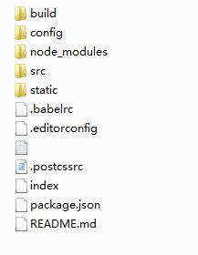
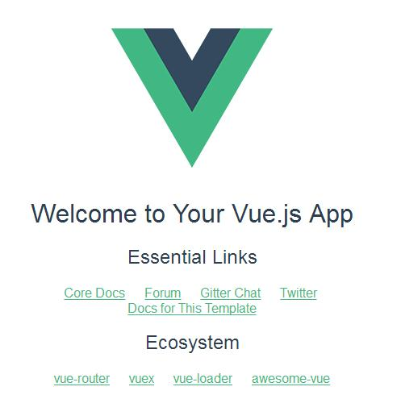

### 搭建vue环境前需要安装node与git
node: [http://nodejs.cn/download/](http://nodejs.cn/download/)
git: [https://git-for-windows.github.io/](https://git-for-windows.github.io/)

### 打开git bash全局安装vue-cli
这里我们将 npm的注册表源设置为淘宝镜像来提升安装速度<!--more-->
```
npm install -g cnpm --registry=https://registry.npm.taobao.org
```
### 全局安装 vue-cli
```
$ cnpm install --global vue-cli
```
### 创建一个基于 webpack 模板的新项目
```
$ cd D:/project/vue
$ vue init webpack myproject
```
### 安装依赖
```
$ cd myproject
$ npm install
```
### 安装完毕在项目文件夹下可以看到如下目录结构


### 让项目跑起来~
```
$ npm run dev
```
执行这步操作即可在浏览器中打开地址为localhost:8080的页面

搭建成功则显示如下：


