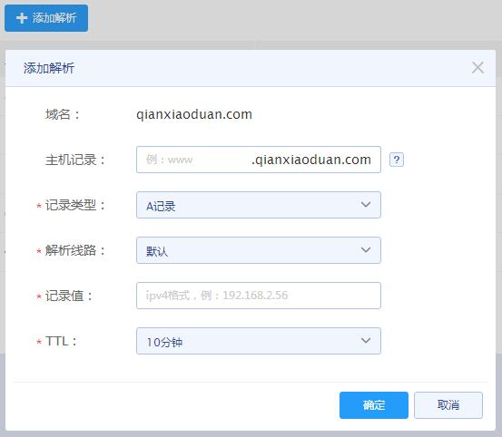
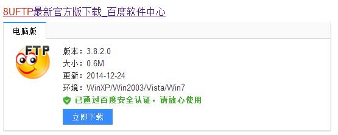
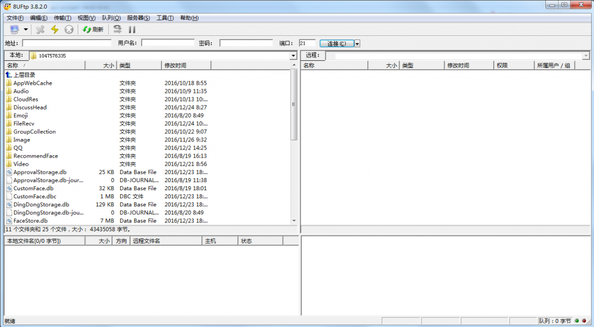
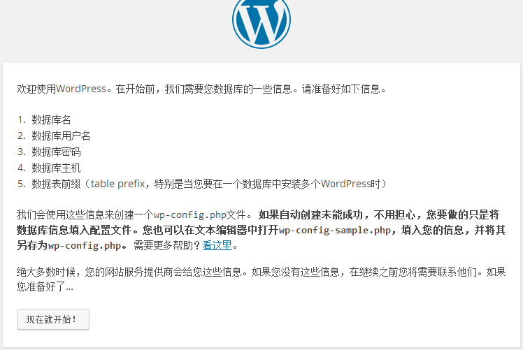
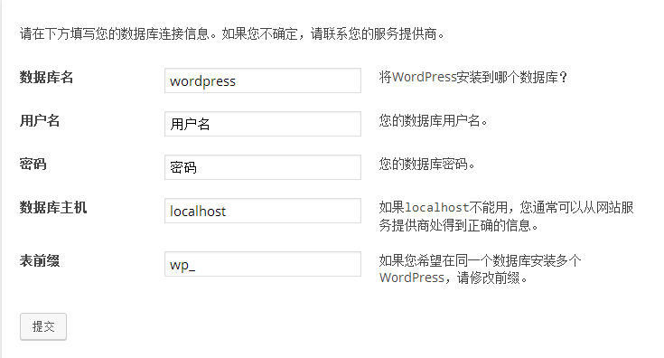
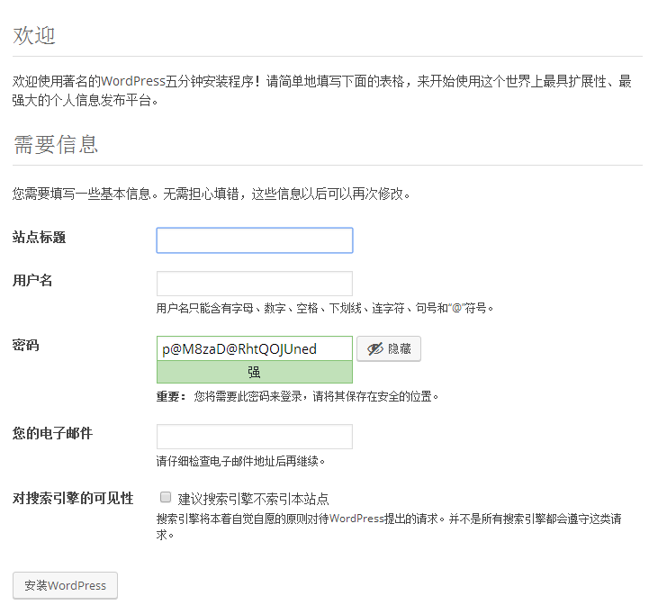
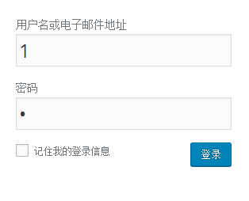
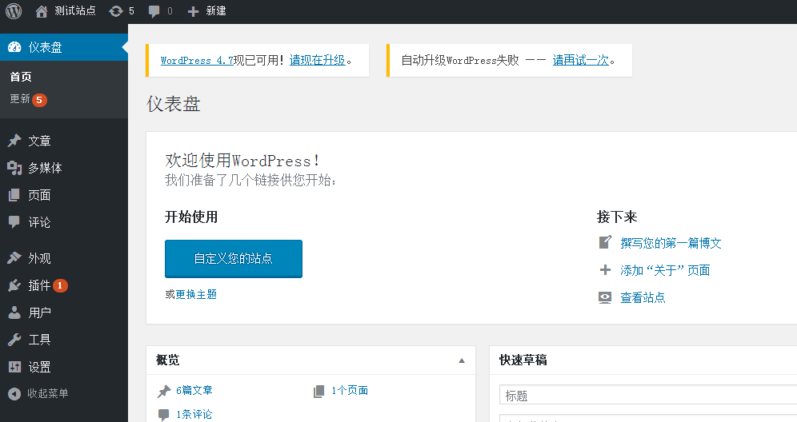

### 前期投入

##### 1.注册域名
域名选择

域名后缀常用的有.com,.net,.org，当然也可以选择一些比较个性的如.top等。
.cn域名属于国家域名，由CNNIC管理，中国互联网络管理中心 （China Internet Network Information Center） 即CNNIC负责管理，因此不建议注册.cn域名。<!--more-->

域名注册机构

国内的有阿里（万网）、易名中国、西部数码、35互联等，国外的有Godaddy、Name等。

域名注册流程

首先通过域名注册商查询想要的域名是否已被注册，如未被注册购买即可，另外别忘记及时给域名续费~

##### 2.空间主机
购买主机的时候需考虑自己的域名是不是需要备案，域名未备案是不能使用大陆的主机的，可以使用国外或者香港的主机，如需备案可以选择国内的主机，阿里、百度、腾讯都是可以的。

##### 3.wordpress博客系统

wordpress博客系统下载地址：[China 简体中文 — WordPress官网](https://cn.wordpress.org/)

### 博客搭建

##### 1.域名解析
域名解析，就是把域名指向空间的IP，让我们能够通过域名访问网站空间。

进入申请域名的服务商网站，登录到自己的账号进入管理中心，点击进入域名管理。在域名列表上对域名进行解析操作。

选择添加解析，常用的解析方式有两种：A记录和CNAME记录，A记录对应记录值为服务器IP，CNAME记录对应值为空间域名，考虑到空间商对空间维护强烈建议使用CNAME记录解析，维护时有可能会换掉你空间对应的IP（大坑~）。

主机记录即域名前缀，常用如下（百度为例）：

1. www：解析后域名为 www.baidu.com

2. @：直接解析主域名 baidu.com

3. *：泛解析，匹配其他所有域名  *.baidu.com

##### 2.wordpress的安装
1.通过ftp工具将下载好的wordpress程序上传到服务器上，ftp工具下载：百度8uftp即可~

上传地址：空间对应IP或者域名，用户名、密码、端口这些在空间管理后台都可以找到，在左边选择本地需要上传的文件，右边选择文件需要上传的目录。可以选择先解压再上传也可以选择先上传压缩包再通过空间后台解压工具进行解压，后者会相对好点（我一般用前面的^_^方便嘛）。

2.上传完毕后在浏览器输入你的域名，如果上传没什么问题的话显示的界面应该是这个：

选择现在就开始：

填入主机上需要使用的数据库名，以及用户名、密码，数据库主机一般为默认，表前缀可以默认，如果数据库中有wp_前缀建议修改该处为其他的如wr_、ab_等，填写完毕选择提交。

数据库连接成功界面：

选择进行安装

设置站点标题、用户名、密码以及电子邮件，用户名、密码即站点后台登录账号、密码，电子邮件用来找回密码、接收留言等，设置完成后选择安装woedpress。

安装完成后登录即可进入后台管理界面：

至此，wordpress就安装完成了，现在网站的页面还是默认的比较简陋，后面我们可以挑选一些漂亮的主题进行安装。